# NEWS

# 20210116

*   Installed tensorflow 2.2, keras and pytorch:

    ```
    pip install tensorflow==2.2 keras    #! install tensorflow
    pip install torch
    ```

    All running:
    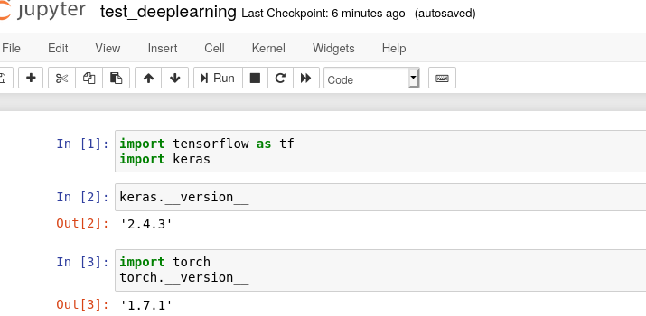

*   Install jupyterhub in conda environment `anaconda3-2020.07`. Runs if installed manually. Fails from script built. Added port 8000 for jupyterhub:

    ```
    config.vm.network "forwarded_port", guest: 8000, host: 8000
    ```

    Linux dependencies for jupyterhub:

    ```
    # for JupyterHub
    apt-get install -y npm nodejs-legacy
    ```

    

*   Install Jupyter in a new pyenv environment in Python 3.7.9

    ```
    pyenv install 3.7.9
    pyenv virtualenv 3.7.9 deeplearning
    mkdir pytorch
    cd pytorch
    pyenv local deeplearning
    pip install tensorflow==2.2 keras    #! install tensorflow
    echo "install jupyter"
    pip install jupyter
    ```

    And in `provision-vagrant.sh`:

    ```
    ExecStart=/home/vagrant/.pyenv/versions/deeplearning/bin/jupyter notebook --port=8890 --no-browser --ip=0.0.0.0 --NotebookApp.token= --notebook-dir=/home/vagrant/
    ```

    In Vagrantfile:

    ```
    config.vm.network "forwarded_port", guest: 8890, host: 8890
    ```

    Installs but it doesn't show in a browser.

*   Install tensorflow on pyenv environment with Python 3.7.9. Success!

    ```
    pip install tensorflow==2.2 keras
    ```

    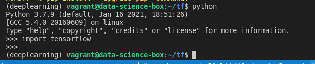

*   Add `deeplearning` environment with pyenv. Install `tensorflow==2.2`

    ```
    cd $HOME
    pyenv install 3.7.9
    pyenv virtualenv 3.7.9 deeplearning
    mkdir pytorch
    cd pytorch
    pyenv local deeplearning
    pip install tensorflow==2.2 keras
    ```

    

*   Add environment variable to `jupyter.service` file:

    ```
    Environment="PATH=/home/vagrant/.pyenv/versions/anaconda3-2020.07/bin:/usr/local/sbin:/usr/local/bin:/usr/sbin:/usr/bin:/sbin:/bin:/snap/bin"
    ```

    And execute jupyter with:

    ```
    ExecStart=/home/vagrant/.pyenv/versions/anaconda3-2020.07/bin/jupyter notebook --port=8888 --no-browser --ip=0.0.0.0 --NotebookApp.token= --notebook-dir=/home/vagrant/data
    ```

    Now Jupyter runs on `anaconda3-2020.07`

*   TensorFlow does not install in Python 3,8.7 or Python 3.9.1

*   PyTorch install successfully with increased disk size under Python 3.7.9

*   Increasing disk size from 10 GB to 20 GB. Success!
    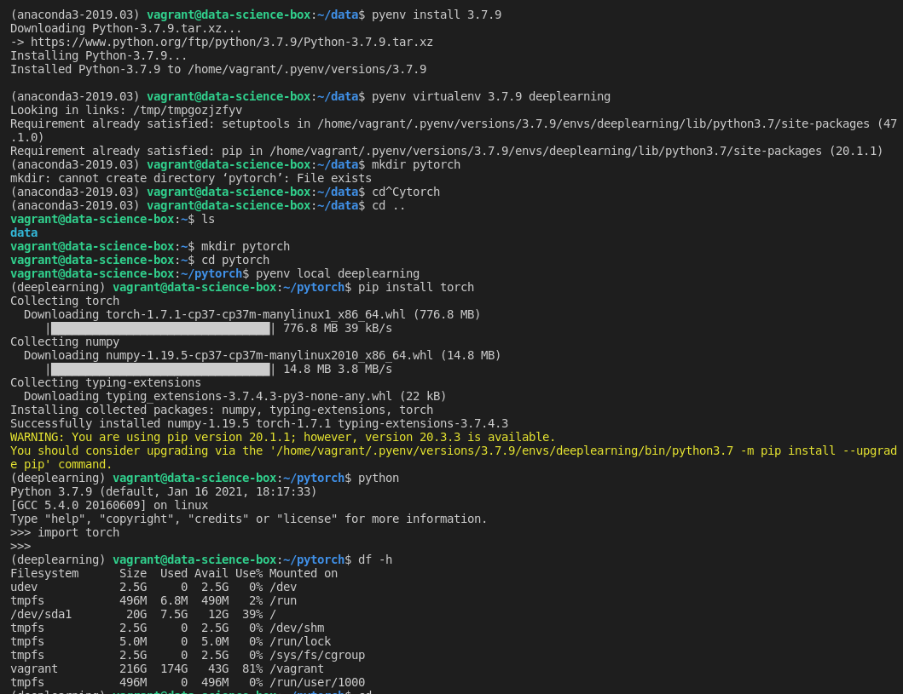

*   Increasing RAM of Vagrant VM. FAILED!
    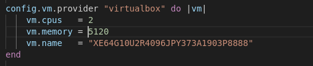

*   Testing pyenv creating an isolated environment for `pytorch`:
    

*   Add Python 3.7.9:
    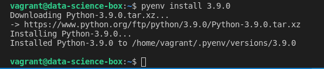

*   Add `pyenv` dependencies in system provisioner:

    ```
    sudo apt-get install -y make build-essential libssl-dev zlib1g-dev \
    libbz2-dev libreadline-dev libsqlite3-dev wget curl llvm libncurses5-dev \
    libncursesw5-dev xz-utils tk-dev libffi-dev liblzma-dev python-openssl
    ```

    

*   Going back to  `anaconda3-2019.03`. Working. **We leave it as is.**
    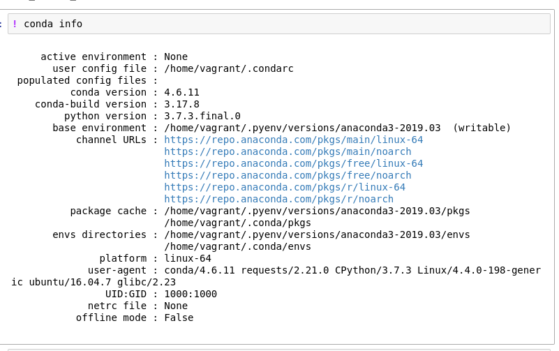

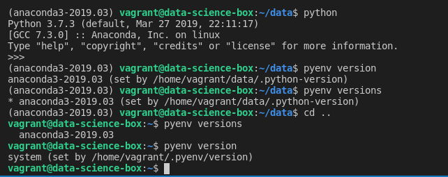

* Trying pyenv `anaconda3-2019.10`. FAILED!

    

    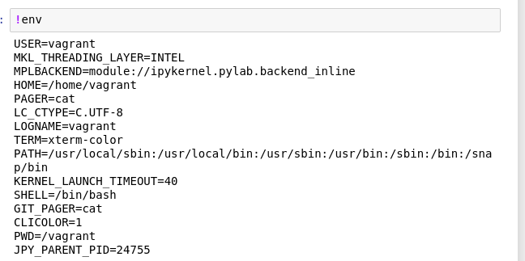

* Trying pyenv `anaconda3-2019.03`. **Success!**.
    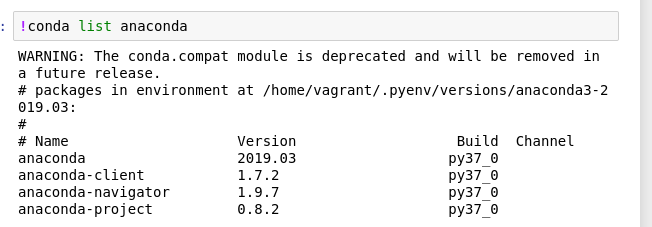
    
* Trying now with `anaconda3-2018.12`, the next version after `anaconda3-5.3.1`. Sucsess!
    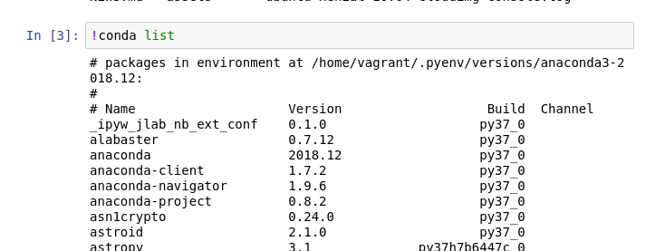
    
* Tried with pyenv `anaconda3-5.3.1`. **Success!** `conda` commands can run from Jupyter. This is the output of `!env`:
    ```
    USER=vagrant
    MKL_THREADING_LAYER=INTEL
    MPLBACKEND=module://ipykernel.pylab.backend_inline
    HOME=/home/vagrant
    PAGER=cat
    LC_CTYPE=C.UTF-8
    LOGNAME=vagrant
    TERM=xterm-color
    PATH=/home/vagrant/.pyenv/versions/anaconda3-5.3.1/bin:/usr/local/sbin:/usr/local/bin:/usr/sbin:/usr/bin:/sbin:/bin:/snap/bin
    SHELL=/bin/bash
    GIT_PAGER=cat
    CLICOLOR=1
    PWD=/vagrant
    JPY_PARENT_PID=17184
    ```

# 20210115
* .`bash_profile` generated by the provisioning script:
    ```
    export PATH="/home/vagrant/.pyenv/bin:$PATH"
    eval "$(pyenv init -)"
    eval "$(pyenv virtualenv-init -)"
    ```
    This line:
    ```
    grep -q -F "export PATH=\"/home/vagrant/.pyenv/bin:\$PATH\"" ~/.bash_profile || echo "export PATH=\"/home/vagrant/.pyenv/bin:\$PATH\"" >> ~/.bash_profile
    ```
    generates `export PATH="/home/vagrant/.pyenv/bin:$PATH"`

    This other line:
    ```
    grep -q -F "eval \"\$(pyenv init -)\"" ~/.bash_profile || echo "eval \"\$(pyenv init -)\"" >> ~/.bash_profile
    ```
    generates this `eval "$(pyenv init -)"`

    And this other line:
    ```
    grep -q -F "eval \"\$(pyenv virtualenv-init -)\"" ~/.bash_profile || echo "eval \"\$(pyenv virtualenv-init -)\"" >> ~/.bash_profile
    ```
    generates this: `eval "$(pyenv virtualenv-init -)"`


* This is the result of running !env in a notebook under `anaconda3-5.1.0`:
    ```
    USER=vagrant
    MKL_THREADING_LAYER=INTEL
    MPLBACKEND=module://ipykernel.pylab.backend_inline
    HOME=/home/vagrant
    PAGER=cat
    LOGNAME=vagrant
    TERM=xterm-color
    PATH=/home/vagrant/.pyenv/versions/anaconda3-5.1.0/bin:/usr/local/sbin:/usr/local/bin:/usr/sbin:/usr/bin:/sbin:/bin:/snap/bin
    SHELL=/bin/bash
    GIT_PAGER=cat
    CLICOLOR=1
    PWD=/vagrant
    JPY_PARENT_PID=13474
    ```
* With  `anaconda3-2020.07` shell calls to conda from Jupyter notebooks will not work.
    
* Switch Anaconda from `anaconda3-5.1.0` to `anaconda3-2020.07`
* Initialize Git repo
* Testing if `!conda list` runs from Jupyter notebook. It does!


# 20210114

* Try installing `tensorflow`. Sucess! But it ate up almost all the hard disk space (10 GB)
    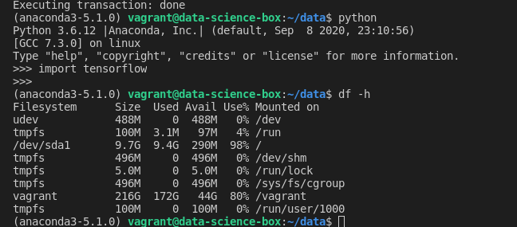
    
* Installing `mxnet`. Failed!
    Disk status after 
    ``/dev/sda1       9.7G  6.5G  3.3G  67% /``
    
    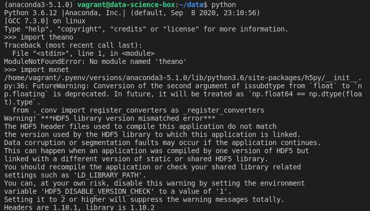

* Deactivate plugin `vagrant-disksize`. Back to 10 GB disk.
* Try increasing disk size from 10 GB to 20 GB. Crashed the VM. New size is recognized. Using plugin `vagrant-disksize`.
* Installing mxnet on folder data. Success!
    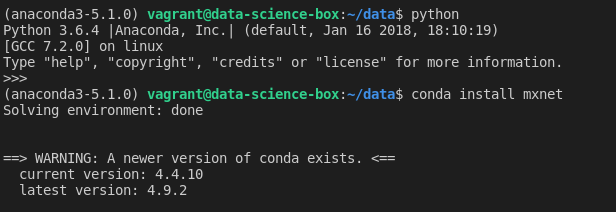
* Tested installing a different `pyenv` with Anaconda.
* Tested installation of `theano`. Success!
